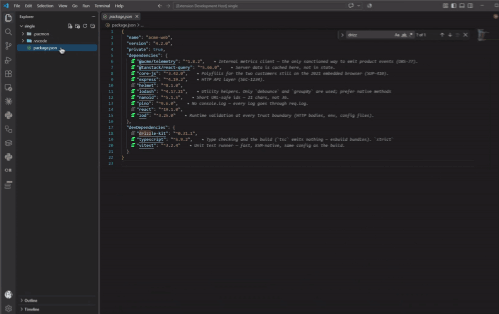
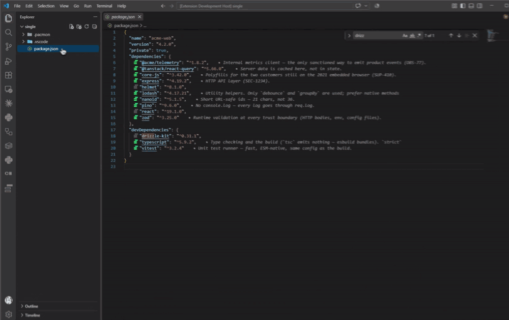
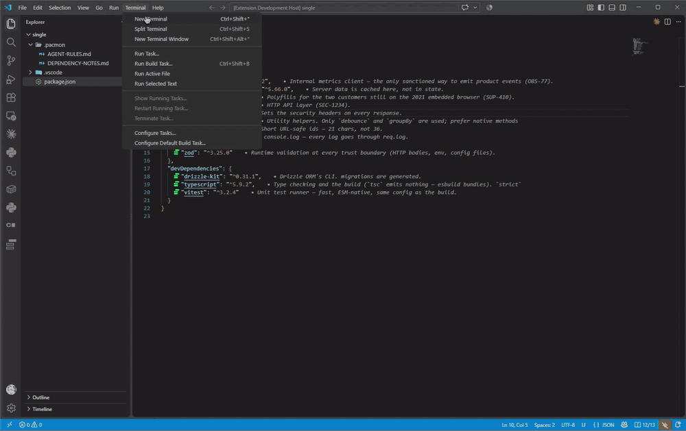

# Pacmon

**`package.json`, `Cargo.toml`, `pom.xml`, `build.gradle`, `mix.exs` and `build.zig.zon` say what you depend on. Pacmon adds why.**

Every dependency gets a short note: why it is here, what must not change, what to check before an upgrade. The note shows in the manifest on hover, and you write it from there.

Notes live in Markdown files under `.pacmon/`, next to the manifest they describe. No database, no service, no account: files that you read, diff and commit like any other. AI coding agents read the same files before they touch a dependency, and keep their own lines in them.



## Supported manifests

| Ecosystem | Manifest | Notes file | Section heading |
|---|---|---|---|
| npm | `package.json` | `.pacmon/DEPENDENCY-NOTES.md` | the package name: `## express`, `## @types/node` |
| Rust | `Cargo.toml` | `.pacmon/cargo/DEPENDENCY-NOTES.md` | the dependency key, usually the crate name: `## serde` |
| Maven | `pom.xml` | `.pacmon/maven/DEPENDENCY-NOTES.md` | `groupId:artifactId`: `## org.slf4j:slf4j-api` |
| Gradle | `build.gradle`, `build.gradle.kts` | `.pacmon/gradle/DEPENDENCY-NOTES.md` | `group:name` or the catalog alias: `## org.slf4j:slf4j-api`, `## libs.junit.jupiter` |
| Elixir / Mix | `mix.exs` | `.pacmon/mix/DEPENDENCY-NOTES.md` | the dependency application atom: `## phoenix`, `## ecto_sql` |
| Zig (VS Code) | `build.zig.zon` | `.pacmon/zig/DEPENDENCY-NOTES.md` | the direct dependency field: `## known_folders` |

Zig manifest support is currently available in the VS Code extension; the JetBrains plugin supports the other rows. Pacmon reads a manifest as text and never runs npm, Cargo, Maven, Gradle, Mix or Zig. It sees the direct dependencies written in the file:

- **npm:** `dependencies`, `devDependencies`, `peerDependencies` and `optionalDependencies`.
- **Rust:** `[dependencies]`, `[dev-dependencies]`, `[build-dependencies]` and their `[target.…]` forms. A member's `serde.workspace = true` counts; `[workspace.dependencies]` itself does not.
- **Maven:** the `<dependencies>` of the project and its profiles, not `<dependencyManagement>` or plugin dependencies. Parent POMs are not read.
- **Gradle:** module coordinates and `libs.*` aliases in a `dependencies` block, not plugins, constraints, `project(…)`, `files(…)` or catalog bundles. The script is never run, so a dependency added by code is not seen.
- **Elixir / Mix:** literal dependency tuples in `def/defp deps` or an inline `deps: [...]` list, including Hex, Git, path and umbrella dependencies. Static `only` and `targets` options are shown as scopes; dynamically assembled lists are not run or guessed.
- **Zig (VS Code):** direct fields of the top-level `.dependencies` struct in `build.zig.zon`, including URL/hash, path and lazy dependencies. `build.zig`, system libraries and transitive dependencies are not evaluated.

Each ecosystem keeps its own notes file, even when two manifests share a folder. A manifest without a notes file of its own uses the nearest one above it for the same ecosystem.

## The notes file

One `## section` per direct dependency. People write under the heading. Agents write under `### Agent notes`.

```md
## express

HTTP API layer (SEC-1234).
Do not upgrade to v5 — the auth middleware is incompatible.

### Agent notes

- purpose: HTTP framework; serves the public REST API and the webhook receiver
- constraint: stay on ^4 — v5 changes router path matching and the session API
- verify: `vitest src/api` and the login e2e (`pnpm e2e:auth`)
- log: 2026-03 agent tried 5.0.1, 14 auth tests failed, reverted (PR #402)
- verified: 4.19.2
```

The file renders on GitHub as it is. A complete npm example is in [`docs/example-repo`](docs/example-repo/).

The file is the only place a note lives. Open it and write a section by hand,
and the manifest shows it at once: the mark before the dependency fills in,
and the first line of the note appears at the end of the line. Nothing is
generated, and nothing is cached anywhere else.



## Features

- Hover a dependency in its manifest to read its note.
- The first line of the note shows at the end of the dependency line.
- A mark before each dependency: filled when it has a note, hollow when it does not.
- Write a note from the manifest: in a side panel, a peek editor, or an input box.
- **Documentation Coverage** lists which dependencies have a note and which do not.
- Problems in the notes file show as warnings, most with a one-click fix.

## Getting started

1. Install Pacmon from the [VS Code Marketplace](https://marketplace.visualstudio.com/items?itemName=kontra.pacmon). VSCodium, Cursor, Windsurf, code-server and other editors that use [Open VSX](https://open-vsx.org/extension/kontra/pacmon) install it from there. IntelliJ IDEA, RustRover, Android Studio, WebStorm and the other JetBrains IDEs install it from the [JetBrains Marketplace](https://plugins.jetbrains.com/plugin/34295-pacmon).
2. Open a `package.json`, `Cargo.toml`, `pom.xml`, `build.gradle`, `build.gradle.kts`, `mix.exs`, or, in VS Code, `build.zig.zon`. A hollow mark appears before every dependency that has no note yet.
3. Right-click a dependency and choose **Pacmon: Add/Edit Dependency Note**, or click the mark. Write one line.
4. The note now shows on hover and at the end of the line. Pacmon created the notes file for that ecosystem next to the manifest, and `.pacmon/AGENT-RULES.md` at the root of the workspace; commit them together with the manifest.

## AI agents

Every section has a second layer, `### Agent notes`, for AI coding agents. They write `- key: value` lines there: `purpose`, `constraint`, `verify`, `log`, `verified` and a few more. Agents never edit the text people wrote.

Run **Pacmon: Set Up AI Instructions** once. It writes the rules and the field list to `.pacmon/AGENT-RULES.md`, and adds a three-line pointer to the instruction files your agents already read: `AGENTS.md`, `CLAUDE.md`, `.cursor/rules/`, `.github/copilot-instructions.md`. The rules say where each ecosystem keeps its notes and how it names its sections. From then on, an agent reads a dependency's section before it adds, upgrades or removes the dependency, and records what it did. Pacmon checks the agent lines: an unknown field or an empty value shows as a warning, with a fix.



Pacmon does not call any AI service. Agents use their own tools; Pacmon gives them the files and the rules.

## Settings

| Setting | Default | What it does |
|---|---|---|
| `pacmon.decorations` | `preview` | The hint at the end of a line that has a note: `preview` (the first line of the note), `badge` (a small marker), or `off`. |
| `pacmon.inlineSource` | `human-first` | Which layer feeds the preview and leads the hover: `human-first`, `ai-first`, `human-only`, `ai-only`. |
| `pacmon.noteEntry` | `panel` | How you write a note from a manifest: `panel`, `peek`, `input`, `inputBeside`, or `comments` (experimental). |
| `pacmon.noteButtons` | `["iconLeft", "link"]` | Clickable ways into a note: `iconLeft`, `link`, `codelens`, `inlayHint`, `lightbulb`. |
| `pacmon.monorepo` | `nearest` | Which notes file a manifest uses: the nearest one for its ecosystem, walking up, or only the one at the workspace root (`rootOnly`). |

The **Pacmon** view in the activity bar switches these without opening the settings editor.

## Requirements

VS Code 1.100 or newer, or a JetBrains IDE 2025.2 or newer. Nothing else: Pacmon reads the manifests itself, so it needs no Rust, Java, Elixir, Zig, TOML, Gradle or Mix installation, and it reads and writes files in your workspace without making network requests. In VS Code it also works in VS Code for the Web (vscode.dev, github.dev), Remote-SSH, WSL and dev containers.

## Format reference

npm notes use the `dependency-notes/1` format. Cargo, Maven, Gradle, Mix and Zig notes use `dependency-notes/2`, whose frontmatter also names the ecosystem. The reference is [`docs/format.md`](docs/format.md); the VS Code extension supports every listed ecosystem, while the JetBrains plugin does not yet support Zig.

## Contributing and license

Pacmon is an early preview and does not accept pull requests yet. Bug reports and feature requests are welcome as [issues](https://github.com/kontratek/pacmon/issues); see [CONTRIBUTING.md](CONTRIBUTING.md). Security problems: see [SECURITY.md](SECURITY.md).

Apache License 2.0 — see [LICENSE](LICENSE). "Pacmon" and the logo are trademarks of Kontra; see [TRADEMARK.md](TRADEMARK.md).
